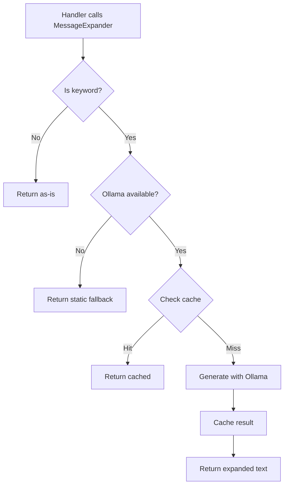

# Hybrid C: Narrative Expansion Architecture

## Overview

**Hybrid C** is an innovative narrative system that uses local LLM (Ollama) to expand keyword-based messages into full narrative responses. This provides **infinite variety at zero cost** while maintaining graceful fallbacks.

### Key Benefits

- ✅ **Zero Cost**: Unlimited generations with local Ollama (no API costs)
- ✅ **Always Fresh**: Same situation produces different responses each time
- ✅ **Graceful Degradation**: Falls back to static messages if Ollama unavailable
- ✅ **Maintainable**: Only keywords need to be maintained, not full text
- ✅ **Fast**: Small models (Llama 3.2 3B) respond in <500ms
- ✅ **Scalable**: Can handle unlimited NPC conversations

---

## Architecture

### Core Components

```
┌─────────────────────────────────────────────────────────────┐
│                    Game Handler Layer                        │
│  (handle-use.ts, handle-take.ts, handle-open.ts, etc.)     │
└──────────────────────┬──────────────────────────────────────┘
                       │
                       ▼
┌─────────────────────────────────────────────────────────────┐
│              Message Expansion Layer                         │
│          (message-expansion.ts utilities)                    │
└──────────────────────┬──────────────────────────────────────┘
                       │
                       ▼
┌─────────────────────────────────────────────────────────────┐
│         Keyword Detection & Context Extraction              │
│         (isKeyword(), expandSystemMessage())                │
└──────────────────────┬──────────────────────────────────────┘
                       │
              ┌────────┴────────┐
              ▼                 ▼
    ┌──────────────────┐  ┌──────────────────┐
    │  expandNarration │  │ expandNPCDialogue│
    │  (AI expansion)  │  │  (AI expansion)  │
    └────────┬─────────┘  └────────┬─────────┘
             │                     │
             ▼                     ▼
    ┌─────────────────────────────────────┐
    │     Local LLM (Ollama)              │
    │     - Llama 3.2 3B                  │
    │     - Port: 11434                   │
    │     - Zero cost, infinite variety   │
    └─────────────────────────────────────┘
```

---

## How It Works

### 1. Keywords Instead of Text

**Before (Old System):**
```typescript
systemMessages: {
  cantUseItem: (itemName: string) =>
    `The ${itemName} doesn't do anything useful here. Wrong place, wrong time.`
}
```

**After (Hybrid C):**
```typescript
systemMessages: {
  cantUseItem: (itemName: string) => "cant_use_item"  // Just a keyword
}
```

### 2. Handler Integration

**Handler Code:**
```typescript
// Old way (static text)
return [{
  type: 'SHOW_MESSAGE',
  speaker: 'narrator',
  content: game.systemMessages.cantUseItem(itemName)
}];

// New way (expanded)
const message = await MessageExpander.cantUseItem(
  game.systemMessages.cantUseItem,
  itemName
);
return [{
  type: 'SHOW_MESSAGE',
  speaker: 'narrator',
  content: message  // Expanded by Ollama or fallback
}];
```

### 3. Expansion Process



---

## Environment Configuration

### `.env` Variables

```bash
# Narrative expansion mode
# - 'local' = Use Ollama for expansion (infinite variety)
# - 'static' = Use static fallbacks (no LLM calls)
NEXT_PUBLIC_NARRATION_MODE=local

# Local LLM configuration (for command interpretation AND narration)
NEXT_PUBLIC_LLM_MODE=local
LOCAL_LLM_BASE_URL=http://localhost:11434
LOCAL_LLM_MODEL_NAME=llama3.2:3b
```

### Mode Comparison

| Mode | Cost | Variety | Requires Ollama | Speed |
|------|------|---------|-----------------|-------|
| `local` | $0 | ♾️ Infinite | Yes | ~500ms |
| `static` | $0 | None | No | Instant |

---

## Usage Examples

### Example 1: System Messages

```typescript
import { MessageExpander } from '@/lib/game/utils/message-expansion';

// Expand "can't use item" message
const message = await MessageExpander.cantUseItem(
  game.systemMessages.cantUseItem,
  'crowbar'
);

// With NEXT_PUBLIC_NARRATION_MODE=local:
// → "The crowbar ain't gonna help you here, detective. Save it for something that matters."

// With NEXT_PUBLIC_NARRATION_MODE=static:
// → "You can't use that here."
```

### Example 2: NPC Dialogue

```typescript
import { expandNPCDialogue } from '@/ai/expand-npc-dialogue';

const result = await expandNPCDialogue({
  npcName: 'Frank the Bartender',
  npcPersonality: 'Gruff, world-weary, but secretly kind',
  keyword: 'greeting_late_night',
  context: { playerName: 'Detective' }
});

console.log(result.dialogue);
// → "Still pounding the pavement, Detective? Usual spot's open if you need it."
```

### Example 3: Direct Expansion

```typescript
import { expandNarration } from '@/ai/expand-narration';

const message = await expandNarration({
  keyword: 'cant_smash_object',
  context: { objectName: 'metal box' },
  tone: 'dark noir detective',
  fallback: 'You can\'t break that.'
});

// → "Nice try, gumshoe. That metal box ain't budging—you'd need a blowtorch
//    and a prayer to crack that thing open."
```

---

## Keyword Reference

### Available Keywords

See `src/ai/expand-narration.ts` for the full `PROMPT_TEMPLATES` mapping.

**Common Keywords:**

| Keyword | Context Variables | Description |
|---------|-------------------|-------------|
| `cant_use_item` | `itemName` | Item doesn't work here |
| `cant_use_item_on_target` | `itemName`, `targetName` | Item doesn't work on target |
| `dont_have_item` | `itemName` | Player doesn't have the item |
| `item_not_visible` | `itemName` | Item not in current location |
| `cant_open_object` | `objectName` | Can't open this object |
| `cant_move_object` | `objectName` | Can't move this object |
| `wrong_password` | - | Wrong password entered |
| `already_have_item` | `itemName` | Already in inventory |
| `inventory_empty` | - | No items in inventory |
| `cannot_go_there` | - | Path blocked |

### NPC Keywords

| Keyword | Context Variables | Description |
|---------|-------------------|-------------|
| `greeting_first_time` | - | First meeting |
| `greeting_repeat` | - | Subsequent meetings |
| `greeting_late_night` | - | Late night greeting |
| `topic_murder` | - | Discussing the crime |
| `topic_suspect` | `suspectName` | Asking about suspect |
| `refuse_answer` | - | Won't answer question |
| `dont_know` | - | Doesn't know answer |
| `surprised` | `surprise` | Reacting to revelation |

---

## Cache System

### Narration Cache

- **TTL**: 30 seconds
- **Max Size**: 100 entries
- **Purpose**: Avoid regenerating identical keywords in quick succession

### NPC Dialogue Cache

- **TTL**: 10 seconds (shorter for more variety)
- **Max Size**: 50 entries
- **Purpose**: Light caching while encouraging variety

### Cache Control

```typescript
import {
  clearNarrationCache,
  getNarrationCacheStats,
  clearNPCDialogueCache,
  getNPCDialogueCacheStats
} from '@/ai';

// Clear caches
clearNarrationCache();
clearNPCDialogueCache();

// Get statistics
const stats = getNarrationCacheStats();
console.log(`Cache size: ${stats.size} entries`);
console.log(`Entries:`, stats.entries);
```

---

## Testing

### Run Test Suite

```bash
npx tsx scripts/test-narrative-expansion.ts
```

### Test Coverage

1. ✅ System message expansion with keywords
2. ✅ NPC dialogue expansion
3. ✅ Cache functionality (hit/miss)
4. ✅ Fallback behavior when Ollama unavailable
5. ✅ Variety testing (same keyword → different results)

---

## Performance Considerations

### Ollama Response Times

| Model | Size | Avg Response Time | Quality |
|-------|------|-------------------|---------|
| Llama 3.2 3B | 1.7 GB | ~300-500ms | Good |
| Llama 3.2 1B | 0.9 GB | ~200-300ms | Fair |
| Llama 3.1 8B | 4.7 GB | ~800-1200ms | Excellent |

**Recommended**: Llama 3.2 3B (best balance)

### Optimization Tips

1. **Use caching**: Enable caching for repeated keywords
2. **Set reasonable maxLength**: Default 200 chars is good
3. **Monitor health**: Check `checkLocalLLMHealth()` before batch operations
4. **Fallback gracefully**: Always provide fallback messages

---

## Adding New Keywords

### 1. Add to Prompt Templates

```typescript
// src/ai/expand-narration.ts
const PROMPT_TEMPLATES: Record<string, string> = {
  // ... existing templates ...

  'new_keyword_here': 'Description of what LLM should generate for {contextVar}.',
};
```

### 2. Add Fallback

```typescript
// src/ai/expand-narration.ts
const SIMPLE_FALLBACKS: Record<string, string> = {
  // ... existing fallbacks ...

  'new_keyword_here': 'Simple static fallback text.',
};
```

### 3. Use in Cartridge

```typescript
// src/lib/game/cartridge.ts
systemMessages: {
  newMessage: (param: string) => "new_keyword_here"
}
```

### 4. Use in Handler

```typescript
// src/lib/game/actions/handle-something.ts
const message = await MessageExpander.static(game.systemMessages.newMessage(param));
```

---

## Troubleshooting

### Issue: "Ollama unavailable"

**Solution**: Start Ollama
```bash
ollama serve
```

### Issue: "Slow responses"

**Solutions**:
1. Use smaller model: `LOCAL_LLM_MODEL_NAME=llama3.2:1b`
2. Reduce maxLength in expansion options
3. Enable caching

### Issue: "Generic responses"

**Solutions**:
1. Improve prompt templates in `PROMPT_TEMPLATES`
2. Add more context variables
3. Use larger model (8B instead of 3B)

### Issue: "Build errors"

**Solution**: Ensure all async functions are marked with `async`
```typescript
// ❌ Wrong
export function handleUse(...): Promise<Effect[]> { ... }

// ✅ Correct
export async function handleUse(...): Promise<Effect[]> { ... }
```

---

## Future Enhancements

### Planned Features

- [ ] **Voice tone profiles**: Different tones per NPC
- [ ] **Context-aware memory**: NPCs remember conversation history
- [ ] **Dynamic personality shifts**: NPCs change based on player actions
- [ ] **Multi-language support**: Expand in different languages
- [ ] **Sentiment analysis**: Detect player frustration and adjust tone

---

## Related Documentation

- `src/documentation/handler-resolution-and-media.md` - Handler patterns
- `src/documentation/npc-schema.md` - NPC structure
- `src/documentation/engine-features.md` - Effect system
- `CLAUDE.md` - Project overview

---

## Credits

**Architecture**: Hybrid C (Hybrid Command + Content Generation)
**LLM**: Ollama (local inference)
**Models**: Meta Llama 3.2 series
**Implementation**: AIRPG_2 project
